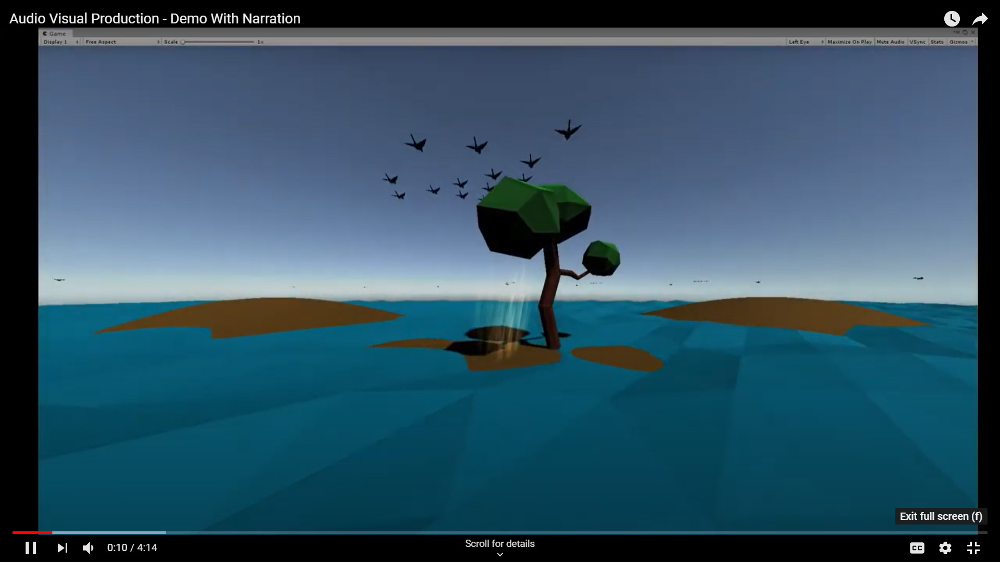

# EARTH: Deforestation
## Team Diverse

Project Leader | Jack King | jack3.king@live.uwe.ac.uk | http://jackkingdev.co.uk/home/

Lead Programmer | Lewis Bond 

Models | Luke Tolchard | luke2.tolchard@live.uwe.ac.uk

Audio Producer | Jack Lynham 

Animations | Hector Martin-Davies 

## Project Overview
This project is a narrated virtual reality experience. It's aimed at the ages of 13 - 17, however would be a viable experience for any age! 
The projects aim was to let the user experience the rainforest destruction through a series of scenes. The first being a tranquil, lush scene
allowing the user to burn the rainforest and finally a hope scene which is to allow the user to reflect on everything they just experienced.

### Click the image below to view our video!

